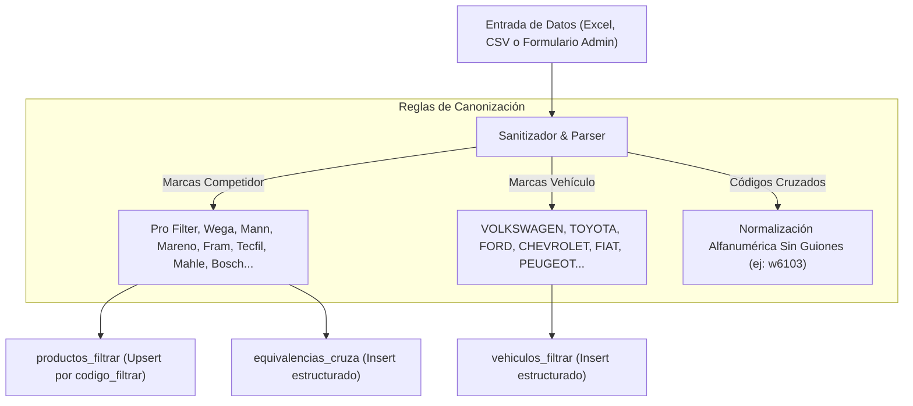
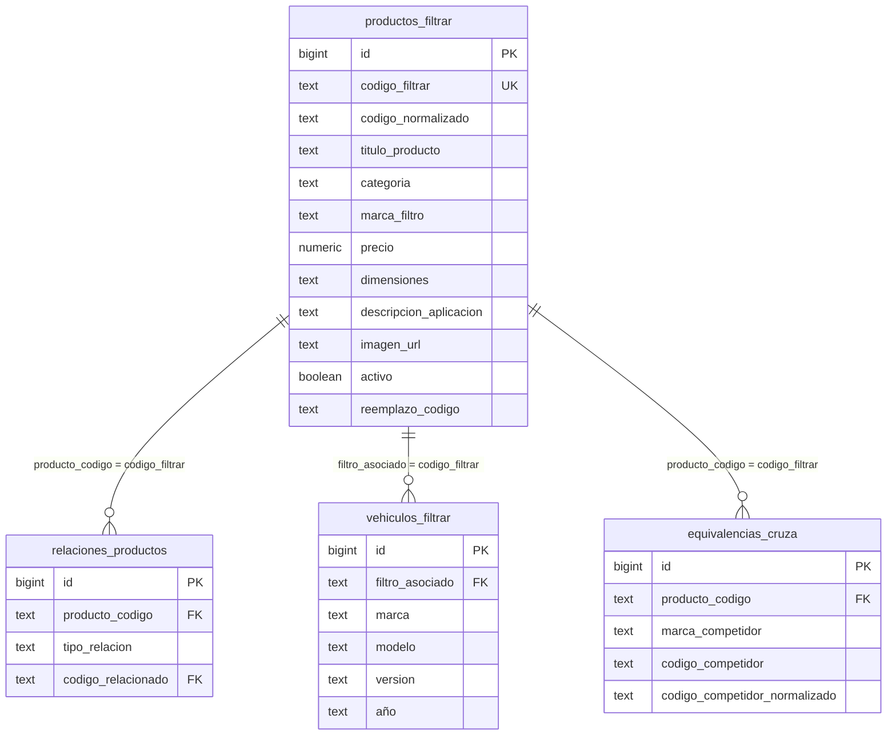

# 🏗️ Arquitectura Técnica y Control Directo de Supabase — FiltrAr Catálogo V2

## 1. Principios Arquitectónicos

1. **Motor Anti-Errores de Tipeo y Canonización de Marcas (`lib/normalization.ts`)**: Sistema de normalización que elimina erratas de tipeo en marcas de competidores (`vw` → `VOLKSWAGEN`, `mann-filter` → `Mann`, `wega sa` → `Wega`, `mh` → `Mareno`) y normaliza códigos cruzados eliminando símbolos, guiones y barras (`W 610/3` → `w6103`, `JFA-0205` → `jfa0205`) tanto en carga manual como en importación masiva de planillas.
2. **Módulo de Importación Masiva Excel / CSV (`/admin/importar`)**: Motor cliente/servidor que lee archivos `.xlsx`, `.xls` y `.csv` usando `xlsx` (SheetJS). Permite descargar plantillas pre-configuradas de 1-clic, previsualizar datos antes de guardar, e importar en lotes de 50 ítems poblando `productos_filtrar`, `equivalencias_cruza` y `vehiculos_filtrar`.
3. **Control Automatizado de Supabase**: Capacidad de leer, actualizar, poblar e impactar la base de datos de Supabase de forma remota a través de la API REST / PostgREST mediante scripts Python en el entorno del asistente.
4. **Alta Dinámica de Marcas y Filtros en Tiempo Real**: Tanto la pantalla de alta (`/admin/producto/nuevo`) como la de edición (`/admin/producto/[codigo]`) permiten seleccionar marcas registradas o pulsar `+ Escribir otra marca...`. El listado de marcas en el catálogo público (`CatalogoProductos.tsx`) se consulta de forma dinámica contra la BD (`SELECT DISTINCT marca_filtro`), haciendo que cualquier marca nueva aparezca de inmediato en los filtros de todo el sitio.
5. **Sanitización de Imágenes y Manejo de Modos**: La función `normalizarImagenes` descarta automáticamente marcadores inválidos (`"preview"`, `"null"`, `"undefined"`, `"[]"`) y si un producto se queda sin fotos, se renderiza la cabecera industrial en modo **Plano Técnico Blueprint** en lugar de romper o mostrar imágenes rotas.
6. **Consolidador de Modelos de Vehículos**: Script ETL inteligente que unificó 1.187 registros de vehículos (Gol I, Gol II, Gol IV → Gol; Golf III..VII → Golf; Focus I..III → Focus; Hilux VI → Hilux; Clio II..IV → Clio), trasladando automáticamente el detalle de generación al campo de versión para evitar redundancias en los desplegables.
7. **Carga Paginada de 25 en 25 (Bypass de Carga de DOM)**: Paginación optimizada de 25 en 25 productos con indicador visual de progreso en `ResultadoBuscador.tsx`, `CatalogoProductos.tsx` y `/admin/productos`.
8. **Panel de Administración Dark Mode (`/admin`) con Live Preview**: Sistema integral de administración con login por JWT sin secretos hardcodeados, protección por middleware de Next.js, subida con compresión automática a WebP (≤100KB) en Supabase Storage, y **Live Preview Card Sidebar**.

---

## 2. Motor de Canonización y Anti-Tipeo (`lib/normalization.ts`)

---

## 3. Diagrama de Entidad-Relación

