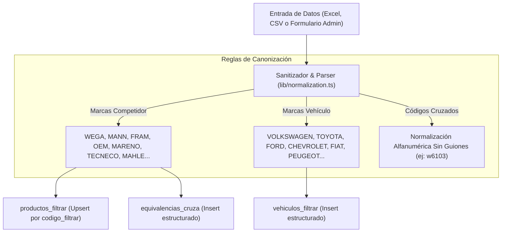
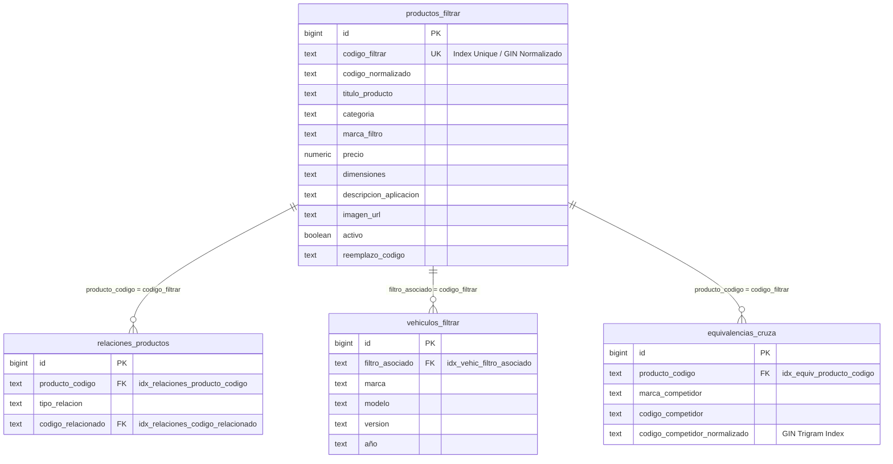
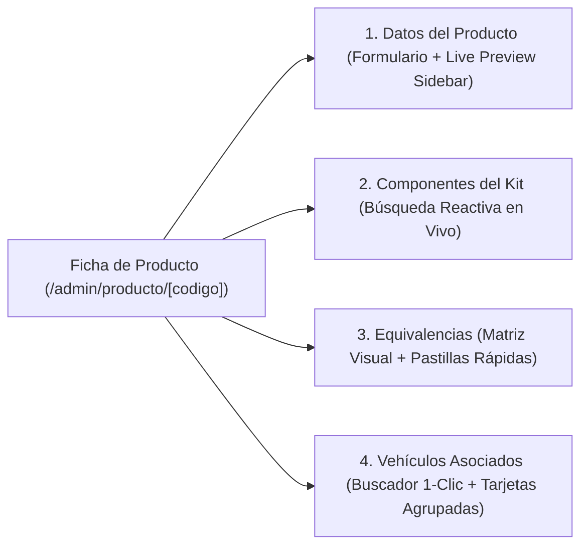

# 🏗️ Arquitectura Técnica y Control Directo de Supabase — FiltrAr Catálogo V2

---

## 1. Principios Arquitectónicos y Filosofía del Sistema

1. **Diseño Visual SaaS Executive (Bordes Nítidos y Jerarquía Limpia)**:
   - Eliminación total del diseño globular redondeado (`rounded-3xl` / `rounded-2xl`).
   - Estandarización en radios de curvatura modernos y accesibles (`rounded-xl`, `rounded-lg`, `rounded-md`).
   - Contraste visual elevado con paleta Dark Mode (`slate-950`, `slate-900`, `slate-800`), bordes sutiles y acentos semánticos de color por contexto.

2. **Motor Anti-Errores de Tipeo y Canonización Automotriz (`lib/normalization.ts`)**:
   - Sanitización en tiempo real de marcas de la competencia (`vw` → `VOLKSWAGEN`, `mann-filter` → `MANN`, `wega sa` → `WEGA`, `mh` → `MARENO`).
   - Normalización alfanumérica pura de códigos cruzados eliminando espacios, guiones, barras y símbolos (`W 610/3` → `w6103`, `JFA-0205` → `jfa0205`).

3. **Arquitecturas Jerárquicas en Lugar de Listas Planas**:
   - **Equivalencias:** Matriz visual agrupada por repuesto FiltrAr, con todas sus marcas competidoras asociadas en badges de color, evitando la repetición monótona de filas sueltas.
   - **Vehículos:** Árbol vertical en 3 niveles (*Marca → Modelo → Versiones/Motorizaciones y Filtros Asociados*), permitiendo ver el "Service Completo" del vehículo de un vistazo.

4. **Smart Autocomplete & One-Click Linking**:
   - Buscadores inteligentes reactivos con *debounce* tanto para asociar componentes a Kits como para vincular aplicaciones vehiculares a repuestos con 1 solo clic.

5. **Alta Dinámica de Marcas y Filtros en Tiempo Real**:
   - Las marcas se consultan dinámicamente contra la base de datos (`SELECT DISTINCT marca_filtro`), reflejando altas instantáneas en todo el catálogo público y administrativo.

6. **Sanitización de Imágenes y Modo Plano Técnico Blueprint**:
   - La función `normalizarImagenes` descarta marcadores inválidos (`"preview"`, `"null"`, `"undefined"`).
   - Si un repuesto carece de fotografía, el sistema renderiza automáticamente la vista industrial técnica **Blueprint** en lugar de romper o mostrar imágenes rotas.

7. **Rendimiento e Índices de Consulta en Supabase**:
   - Consultas indexadas por campos clave y trigrams para búsquedas instantáneas en catálogos de más de 10.000 registros.

---

## 2. Diagrama de Flujo del Motor de Canonización (`lib/normalization.ts`)

---

## 3. Diagrama de Entidad-Relación e Índices

### Índices de Rendimiento Creados en Supabase:
- `idx_vehic_filtro_asociado` en `vehiculos_filtrar(filtro_asociado)`: aceleración de carga de aplicaciones por filtro.
- `idx_relaciones_producto_codigo` en `relaciones_productos(producto_codigo)`: aceleración de componentes de kits.
- `idx_relaciones_codigo_relacionado` en `relaciones_productos(codigo_relacionado)`: integridad referencial inversa.
- `idx_equiv_producto_codigo` en `equivalencias_cruza(producto_codigo)`: aceleración de cruces por repuesto.

---

## 4. Módulos y Arquitectura del Panel de Administración (`/admin`)

### A. Catálogo de Productos (`/admin/productos`)
- **Segmented Nav de Categorías en 1 Sola Línea:**
  - Pestañas concisas con contadores en vivo: `Todos (1.292)`, `Aceite (103)`, `Aire (953)`, `Combustible (58)`, `Habitáculo (111)`, `Inyección (47)`, `Kits (20)`, `Varios`.
  - Pestaña activa destacada con fondo azul de alto contraste.
- **Badges Semánticos de Categoría:**
  - 🟨 **Aceite:** Ámbar (`bg-amber-500/10 text-amber-300`)
  - 🟦 **Aire:** Celeste Sky (`bg-sky-500/10 text-sky-300`)
  - 🟩 **Combustible:** Verde Esmeralda (`bg-emerald-500/10 text-emerald-300`)
  - 🟪 **Habitáculo:** Púrpura (`bg-purple-500/10 text-purple-300`)
  - 🔷 **Inyección:** Cian (`bg-cyan-500/10 text-cyan-300`)
  - 🟦 **Kits:** Índigo (`bg-indigo-500/10 text-indigo-300`)
- **Toolbar de Filtros Unificada:** Buscador con botón `✕` para limpiar, selectores de Marca, Estado y Ordenamiento con resumen de chips activos y botón `Restablecer`.

---

### B. Matriz de Equivalencias (`/admin/equivalencias`)
- **Vista Agrupada por Producto (Por Defecto):**
  - Cada fila representa un repuesto de FiltrAr con su miniatura, código, título y categoría.
  - Muestra todos sus cruces juntos como pastillas con el color característico de la marca competidora:
    - `[ WEGA: WO-154 ✕ ]` `[ MANN: W712/75 ✕ ]` `[ FRAM: PH10904 ✕ ]` `[ OEM: 15601-02010 ✕ ]` `[ MARENO: MR-154 ✕ ]`
  - Botón directo `+ Cruce` para agregar una nueva marca al producto con el código ya precargado.
- **Pestañas de Diagnóstico de Cobertura:**
  - `Todos los Productos (1.292)`
  - `Con Cruces Cargados` (conteo en verde)
  - `Sin Equivalencias / Faltantes` (conteo en ámbar): permite auditar de inmediato qué filtros carecen de equivalencias registradas.
- **Modo de Vista Dual:** Toggle en la esquina superior para alternar entre **`🗂️ Por Producto`** (Matriz) y **`📋 Lista Plana`** (Tabla tradicional enriquecida).

---

### C. Explorador Jerárquico de Vehículos (`/admin/vehiculos`)
- **Árbol Vertical Completo en 3 Niveles:**
  - **Nivel 1 (Marcas):** Listado vertical de todas las marcas registradas (*Mercedes-Benz, Ford, Iveco, Scania, Fiat, Volkswagen, Renault, Toyota, Chevrolet*, etc.) ordenables por **Más Populares** o **A - Z**.
  - **Nivel 2 (Modelos):** Al hacer clic en una marca, se despliegan hacia abajo todos sus modelos con sangría y línea guía visual.
  - **Nivel 3 (Versiones y Filtros):** Al hacer clic en un modelo (ej: `AMAROK`), se despliega la tabla de versiones/motorizaciones con todos sus filtros asociados (*Aire, Aceite, Combustible, Habitáculo*) con sus badges de categoría y botón de desasociación.
- **Buscador Reactivo con Auto-Apertura:** Al tipear cualquier vehículo o código (*"Hilux 2.8"*, *"Amarok V6"*, *"OF-719V"*), el sistema filtra y despliega automáticamente la marca y modelo correspondientes.
- **Botón Contextual `+ Filtro`:** Abre la ventana de asociación con la Marca y el Modelo preseleccionados.

---

### D. Ficha y Edición de Producto (`/admin/producto/[codigo]`)

La pantalla de edición se estructura en 4 pestañas interactivas:

1. **Pestaña 1: Datos del Producto:**
   - Edición de título, categoría, marca (con selector de marcas dinámicas o creación de marca nueva), dimensiones, descripción y precio.
   - Uploader con compresión automática a WebP (≤100KB) en Supabase Storage.
   - **Live Preview Card Sidebar:** Previsualización en tiempo real idéntica a cómo se verá el repuesto en el catálogo público.

2. **Pestaña 2: Componentes del Kit (si el código inicia con `KIT`):**
   - Buscador inteligente con *debounce* para agregar filtros individuales al kit en tiempo real con resolución automática de detalles.

3. **Pestaña 3: Equivalencias:**
   - **Pastillas de Selección Rápida:** Botones (`WEGA`, `MANN`, `FRAM`, `OEM`, `MARENO`, `TECNECO`, `MASTERFILT`, `MAHLE`) para seleccionar la marca con 1 solo toque.
   - **Matriz de Tarjetas Visuales:** Cada cruce se presenta como una tarjeta estilizada con código de color semántico y botón `🗑️` directo de eliminación.

4. **Pestaña 4: Vehículos Asociados:**
   - **Buscador Rápido Autocompletable:** Barra de búsqueda arriba (`🔍 Vincular vehículo existente rápido`) para asociar vehículos del catálogo en 1 clic.
   - **Visualización Agrupada por Marca y Modelo:** Cada marca tiene su tarjeta estructurada con sus modelos y motorizaciones.
   - **Formulario Manual Colapsable:** Oculto por defecto, se despliega con el botón `+ Agregar Manual / Nuevo` para casos donde se deba registrar una motorización inédita.

---

### E. Módulo de Importación Masiva (`/admin/importar`)
- Wizard en 3 pasos con validación en cliente mediante SheetJS (`xlsx`).
- Descarga de plantillas modelo en 1 clic para Productos, Equivalencias y Vehículos.
- Previsualización tabular con control de duplicados y subida por lotes de 50 registros para evitar timeouts.

---

## 5. Esquema de Seguridad y Autenticación
- **Login Administrativo (`/admin/login`):** Validación de credenciales contra Supabase Auth mediante sesión JWT segura (sin secretos expuestos en el cliente).
- **Protección por Middleware (`middleware.ts`):** Redirección automática de rutas `/admin/*` hacia `/admin/login` para sesiones no autenticadas.
- **Row Level Security (RLS):** Lectura pública para el catálogo de clientes (`anon`), escritura restringida a usuarios autenticados (`authenticated`).
