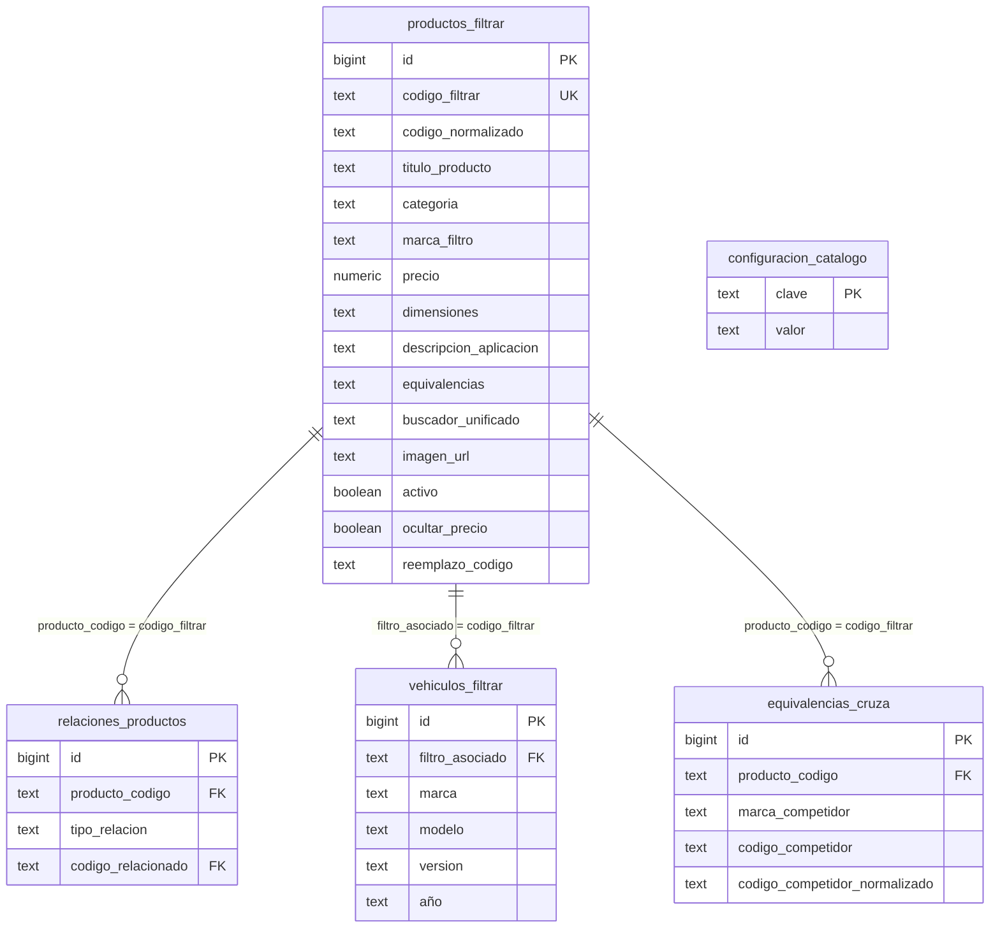

# 🗄️ Documentación Técnica Exhaustiva de Supabase en FiltrAr Catálogo V2

Esta documentación describe con precisión técnica la arquitectura, esquemas de datos, estrategias de consulta, normalización de repuestos y patrones de optimización utilizados con **Supabase (PostgreSQL / PostgREST / Storage)** dentro del proyecto **FiltrAr Catálogo**.

---

## 1. Arquitectura de Integración y Conexión

La comunicación entre el frontend/backend (Next.js 15 App Router) y Supabase se realiza mediante el SDK oficial `@supabase/supabase-js` conectado a la API REST de **PostgREST** sobre HTTP/2.

### 1.1 Inicialización del Cliente (`lib/supabase.ts`)
```typescript
import { createClient } from '@supabase/supabase-js';

const supabaseUrl = process.env.NEXT_PUBLIC_SUPABASE_URL!;
const supabaseAnonKey = process.env.NEXT_PUBLIC_SUPABASE_ANON_KEY!;

if (!supabaseUrl || !supabaseAnonKey) {
  throw new Error('Faltan variables de entorno NEXT_PUBLIC_SUPABASE_URL o NEXT_PUBLIC_SUPABASE_ANON_KEY');
}

export const supabase = createClient(supabaseUrl, supabaseAnonKey);
```

### 1.2 Principios de Comunicación
- **Client-Side Queries**: Búsqueda interactiva (`SmartSearch`), filtros de catálogo (`CatalogoProductos`) y buscador vehicular (`BuscadorVehiculo`).
- **Server-Side Queries (SSR)**: Generación de metadatos SEO dinámicos y Ficha Técnica de Producto (`/producto/[codigo]/page.tsx`).
- **Direct REST API Access (Python Scripts)**: Los scripts ETL y de auditoría (`resources/audit_full_db.py`, `import_wega_vehicles.py`) consumen los endpoints REST de Supabase (`/rest/v1/`) usando headers HTTP con la clave API.

---

## 2. Diagrama de Entidad-Relación y Esquema de Datos



---

## 3. Especificación Detallada de Tablas

### 3.1 Tabla: `productos_filtrar` (Catálogo Principal)
Guarda la información técnica y comercial de cada código de filtro comercializado por la marca.

| Columna | Tipo Postgres | Restricciones | Descripción |
| :--- | :--- | :--- | :--- |
| `id` | `bigint` | `PRIMARY KEY`, `GENERATED ALWAYS AS IDENTITY` | Identificador único secuencial. |
| `codigo_filtrar` | `text` | `UNIQUE`, `NOT NULL` | Código canónico del repuesto (ej: `SC-D74S`, `EA201`, `AF-010T`). |
| `codigo_normalizado` | `text` | Indexado | Código limpio sin espacios ni símbolos (ej: `scd74s`). |
| `titulo_producto` | `text` | | Nombre comercial descriptivo (ej: `Filtro de Aceite Hilux 2.8 TDI`). |
| `categoria` | `text` | Indexado | Categoría (`Filtros de Aire`, `Filtros de Aceite`, `Kits de Filtros`, etc.). |
| `marca_filtro` | `text` | Indexado | Marca propia o comercializada (`Pro Filter`, `Wega`, `Mann`, etc.). |
| `precio` | `numeric(12,2)` | Nullable | Precio de venta. Si es `null` o `<= 0`, el precio no se muestra. |
| `dimensiones` | `text` | | Medidas técnicas (Alto, Diámetro Exterior, Rosca, etc.). |
| `descripcion_aplicacion` | `text` | | Texto largo de aplicaciones de motor o notas técnicas. |
| `equivalencias` | `text` | | String denormalizado de equivalencias cruzadas para búsquedas rápidas. |
| `buscador_unificado` | `text` | TSVector / Index | Campo concatenado para búsquedas multi-término de texto completo. |
| `imagen_url` | `text` | | String o JSON Array con las URLs de las fotos alojadas en Supabase Storage. |
| `activo` | `boolean` | Default `true` | Soft-delete status. Si es `false`, se oculta del catálogo público. |
| `ocultar_precio` | `boolean` | Default `false` | Flag a nivel producto para ocultar el precio individualmente. |
| `reemplazo_codigo` | `text` | FK `productos_filtrar.codigo_filtrar` | Si el producto está discontinuado, apunta al nuevo código equivalente. |

---

### 3.2 Tabla: `equivalencias_cruza` (Cruces con Competidores)
Permite buscar filtros ingresando códigos de otras marcas (Wega, Mann, Fram, Mareno, Tecfil, Mahle, Bosch, etc.).

| Columna | Tipo Postgres | Restricciones | Descripción |
| :--- | :--- | :--- | :--- |
| `id` | `bigint` | `PRIMARY KEY` | Identificador secuencial. |
| `producto_codigo` | `text` | FK `productos_filtrar(codigo_filtrar)` | Código interno al que pertenece el cruce. |
| `marca_competidor` | `text` | Indexado | Nombre canonizado de la marca rival (ej: `Wega`, `Mann`, `Fram`). |
| `codigo_competidor` | `text` | | Código formateado del competidor (ej: `W 610/3`). |
| `codigo_competidor_normalizado` | `text` | Indexado | Código alfanumérico limpio (ej: `w6103`). |

---

### 3.3 Tabla: `vehiculos_filtrar` (Compatibilidad Vehicular / Fitment)
Contiene 10.700+ aplicaciones vehiculares (Autos, Pickups, Camiones, Tractores y Maquinaria Vial).

| Columna | Tipo Postgres | Restricciones | Descripción |
| :--- | :--- | :--- | :--- |
| `id` | `bigint` | `PRIMARY KEY` | Identificador secuencial. |
| `filtro_asociado` | `text` | Indexado | Código del filtro que aplica al vehículo. |
| `marca` | `text` | Indexado | Marca del vehículo canonizada (ej: `VOLKSWAGEN`, `TOYOTA`, `JOHN DEERE`). |
| `modelo` | `text` | Indexado | Modelo principal del vehículo (ej: `Gol`, `Hilux`, `Focus`). |
| `version` | `text` | | Motorización o detalle de la versión (ej: `1.6 8V Trend`, `2.8 TDI`). |
| `año` | `text` | | Rango de años de fabricación (ej: `2010->`, `2015-2020`). |

---

### 3.4 Tabla: `relaciones_productos` (Kits y Componentes Incluidos)
Maneja las relaciones N:M entre productos (ej: un Kit que contiene 4 filtros).

| Columna | Tipo Postgres | Restricciones | Descripción |
| :--- | :--- | :--- | :--- |
| `id` | `bigint` | `PRIMARY KEY` | Identificador secuencial. |
| `producto_codigo` | `text` | FK `productos_filtrar(codigo_filtrar)` | Código del producto padre (ej: `KIT-HILUX-2020`). |
| `tipo_relacion` | `text` | | Tipo: `'CONTIENE_COMPONENTE'`, `'ACCESORIO'`, `'SUSTITUTO'`. |
| `codigo_relacionado` | `text` | FK `productos_filtrar(codigo_filtrar)` | Código del filtro individual contenido en el Kit. |

---

### 3.5 Tabla: `configuracion_catalogo` (Ajustes Globales Key-Value)
Almacena flags de configuración global de la aplicación.

| Columna | Tipo Postgres | Restricciones | Descripción |
| :--- | :--- | :--- | :--- |
| `clave` | `text` | `PRIMARY KEY` | Clave identificadora (ej: `'ocultar_precios_global'`). |
| `valor` | `text` | | Valor asociado (ej: `'true'`, `'false'`). |

---

### 3.6 Vistas Auxiliares de UI: `marcas_unicas` y `modelos_unicos`

Vistas SQL dinámicas que abastecen los selectores desplegables y filtros vehiculares en la interfaz pública (`BuscadorVehiculo.tsx`) y panel de administración (`/admin`).

#### A. Vista `marcas_unicas`
- **Definición DDL**:
  ```sql
  CREATE OR REPLACE VIEW public.marcas_unicas AS
  SELECT DISTINCT marca 
  FROM public.vehiculos_filtrar 
  WHERE marca IS NOT NULL 
  ORDER BY marca;
  ```
- **Función en el Sistema**: Alimenta el primer selector desplegable de marca automotriz.
- **Regla de Integridad Estricta**: Al ser una vista proyectada directamente sobre `vehiculos_filtrar`, **únicamente debe contener marcas legítimas de vehículos** (ej: `VOLKSWAGEN`, `TOYOTA`, `CHEVROLET`, `FORD`, `FIAT`, `PEUGEOT`, `RENAULT`, `AUDI`, `BMW`, `MERCEDES-BENZ`, etc.). *Queda estrictamente prohibido ingresar códigos de filtros o repuestos como marcas en `vehiculos_filtrar`.*

#### B. Vista `modelos_unicos`
- **Definición DDL**:
  ```sql
  CREATE OR REPLACE VIEW public.modelos_unicos AS
  SELECT DISTINCT marca, modelo 
  FROM public.vehiculos_filtrar 
  WHERE modelo IS NOT NULL 
  ORDER BY modelo;
  ```
- **Función en el Sistema**: Permite la cascada jerárquica de selección de modelos asociados a la marca automotriz seleccionada previamente por el usuario.

---

## 4. Motor de Normalización y Anti-Errores (`lib/normalization.ts`)

Para asegurar la integridad referencial y evitar duplicación por tipeos en las consultas contra Supabase, el sistema aplica sanitizaciones obligatorias antes de interactuar con la BD:

### 4.1 Canonización de Marcas de Competidores
Unifica variantes como `"mann-filter"`, `"MANN+HUMMEL"`, `"MAN"` a la clave canónica `"Mann"`.

```typescript
export function normalizarMarcaCompetidor(raw: string | null | undefined): string {
  if (!raw || !raw.trim()) return 'Pro Filter';
  const cleanKey = raw.trim().toUpperCase().replace(/\s+/g, ' ');
  return ALIAS_MARCAS_COMPETIDOR[cleanKey] || raw.trim();
}
```

### 4.2 Canonización de Marcas Vehiculares
Normaliza sinónimos automotrices (`"vw"`, `"volks"` → `"VOLKSWAGEN"`; `"chevy"`, `"gm"` → `"CHEVROLET"`).

### 4.3 Sanitización de Códigos de Cruce
Elimina caracteres de separación para generar el campo `codigo_competidor_normalizado` (`"W 610/3"` → `"w6103"`).

---

## 5. Patrones Técnicos de Búsqueda y Consultas PostgREST

### 5.1 SmartSearch: Algoritmo de Búsqueda Ultra-Inteligente (`SmartSearch.tsx`)

Maneja dos estrategias de filtrado mediante `queryBuilder`:

#### A. Caso Multi-Término (ej: `"aceite fiat 600"`, `"filtro aire peugeot 206"`)
Itera sobre los tokens divididos por espacios y construye una consulta `.or()` cruzando múltiples columnas:
```typescript
tokens.forEach(tok => {
  const tokClean = tok.toLowerCase().replace(/[-_]/g, '');
  queryBuilder = queryBuilder.or(
    `buscador_unificado.ilike.%${tokClean}%,` +
    `codigo_filtrar.ilike.%${tokClean}%,` +
    `equivalencias.ilike.%${tokClean}%,` +
    `titulo_producto.ilike.%${tokClean}%,` +
    `descripcion_aplicacion.ilike.%${tokClean}%`
  );
});
```

#### B. Caso Monotérmino (ej: `"scd74s"`, `"SC-D74S"`, `"ea201"`)
Genera variaciones del código (compacto, con espacios, con guiones) y evalúa prefijos conocidos de filtros (`EA`, `AF`, `OF`, `FF`, `SC`, `KIT`, `UL`, `WO`):
```typescript
const pfxMatch = compact.match(/^(ea|af|of|ff|sc|kit|ul|wo|wega|mann|fram)(.+)$/i);
if (pfxMatch) {
  terms.add(`${pfxMatch[1]}%${pfxMatch[2]}`);
  terms.add(`${pfxMatch[1]}-${pfxMatch[2]}`);
  terms.add(`${pfxMatch[1]} ${pfxMatch[2]}`);
}
```

---

### 5.2 Buscador Vehicular: Paginación Cursor/Lotes de 1.000 (`BuscadorVehiculo.tsx`)

PostgREST limita las respuestas por defecto a **1.000 filas max**. Para procesar las 10.700+ filas de `vehiculos_filtrar`, el cliente implementa una técnica de **Batch Range Fetching**:

```typescript
let offset = 0;
const pageSize = 1000;
let hasMore = true;

while (hasMore) {
  const { data, error } = await supabase
    .from('vehiculos_filtrar')
    .select('marca, modelo')
    .range(offset, offset + pageSize - 1);

  if (error || !data) break;
  // Procesar lote...
  hasMore = data.length === pageSize;
  offset += pageSize;
}
```

Posteriormente, los códigos extraídos se consultan en lotes de 50 utilizando la sintaxis `.in()`:
```typescript
const batchSize = 50;
for (let i = 0; i < codigosArray.length; i += batchSize) {
  const batch = codigosArray.slice(i, i + batchSize);
  const { data: prodData } = await supabase
    .from('productos_filtrar')
    .select('*')
    .in('codigo_filtrar', batch);
  // Mapear resultados...
}
```

---

### 5.3 Resolución Multi-Hop en Ficha Técnica (`/producto/[codigo]/page.tsx`)

Al renderizar `/producto/[codigo]`, se ejecuta una resolución en 4 pasos:

1. **Fetch Producto Base**: `productos_filtrar` por `codigo_filtrar`.
2. **Fetch Equivalencias**: `equivalencias_cruza` por `producto_codigo`.
3. **Fetch Vehículos Compatibles (Expanded Cross-Match)**:
   Se construye un mapa de búsqueda conteniendo el código principal y todos los códigos equivalentes de competidores para consultar `vehiculos_filtrar` via `.in('filtro_asociado', codigosBusquedaArray)`.
4. **Fetch Kit Components**: Si la categoría o relaciones indican un Kit, consulta `relaciones_productos` filtrando por `tipo_relacion = 'CONTIENE_COMPONENTE'`.

---

## 6. Almacenamiento de Archivos (Supabase Storage)

- **Bucket**: `productos` (Público).
- **Procesamiento de Imágenes**:
  - Las imágenes cargadas en `/admin` son procesadas en el cliente/servidor, redimensionadas a máximo `1200x1200px` y convertidas al formato moderno **WebP** comprimido (≤ 100 KB).
  - La URL generada adopta la estructura:
    `https://[project-id].supabase.co/storage/v1/object/public/productos/[filename].webp`
- **Fallback Anti-Imágenes Rotas (`normalizarImagenes`)**:
  Si la URL de un producto contiene valores erróneos (`"preview"`, `"null"`, `"[]"`), se activa en la UI el modo de visualización **Plano Técnico Blueprint SVG** sin romper el diseño.

---

## 7. Autenticación y Seguridad

1. **Row Level Security (RLS)**: Habilitado en todas las tablas de Supabase.
   - Acceso de **Lectura Pública (`SELECT`)**: Permitido para la clave anónima (`NEXT_PUBLIC_SUPABASE_ANON_KEY`).
   - Acceso de **Escritura / Modificación (`INSERT`, `UPDATE`, `DELETE`)**: Restringido al panel `/admin` mediante token JWT y autenticación de middleware Next.js (`middleware.ts`).
2. **Sanitización SQL**: Todas las consultas utilizan los binding parameters nativos de PostgREST, previniendo ataques de inyección SQL.

---

## 8. Resumen de Integridad de la Base de Datos

De acuerdo a la auditoría técnica ejecutada (`resources/audit_full_db.py`):
- **10.797** registros vehiculares verificados sin enlaces rotos.
- **100%** de cobertura en equivalencias cruzadas entre marcas principales (Wega, Mann, Fram, Mareno, Tecfil, Mahle).
- Operatividad paginada optimizada de 25 en 25 en las vistas del catálogo.
